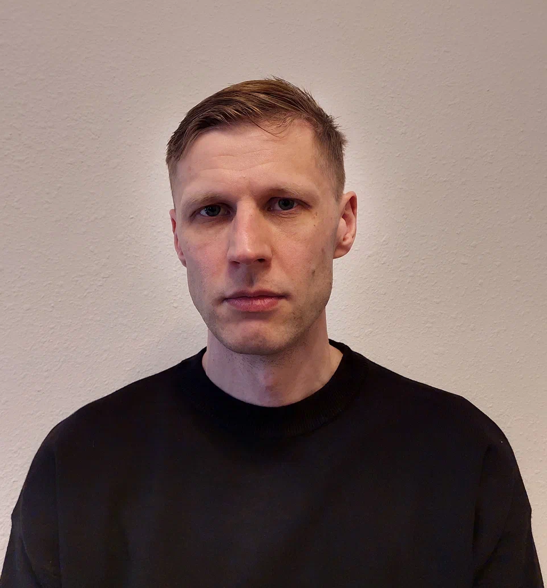

**Григорий Лоскутов**  
дата рождения: 21 апреля 1986  
тел. +7 (995) 399-34-59  
email: [greg3mbpp@yandex.ru](mailto:greg3mbpp@yandex.ru)  
Telegram: [t.me/Gregory_Los](https://t.me/Gregory_Los)  
**Разработчик на C++**

# **Ключевые компетенции**

- Языки программирования: С++
- Операционные системы: Windows, Linux
- Базы данных: PostgreSQL
- Фреймворки: QT, STL, Unreal Engine 5, Arduino
- Инструменты тестирования: Catch 2
- Методологии: ООП, RAII, многопоточное программирование
- Инструментарий: Visual Studio, Arduino Studio, QT Designer, System Workbench for STM32
- Системы контроля версий: Git

# **Профессиональный опыт**

09.2022 – 02.2024

**Учебные проекты в Нетологии**

_направление «Программирование», курс «Разработчик на C++» (программа курса_ [_по ссылке_](https://netology.ru/programs/cpp-developer)_)_

#### Проект: приложение «Инспектор аэропортов»

Решенные задачи: создано приложение, позволяющее просматривать расписание авиарейсов и получать статистику загруженности аэропортов за разные промежутки времени

Используемые технологии: Qt6, QtConcurrent, PostgreSQL, QtCharts

<https://github.com/Grigorii-Loskutov/Qt_projects/tree/main/AirportInspector>

#### Проект: датчик движения для умного дома

Решенные задачи: создан проект для модуля управления системы “Умный дом”

Используемые технологии: Wi-Fi, UART, ESP32, аналоговые датчики

<https://github.com/Grigorii-Loskutov/SmartHome/tree/main>

#### Проект: поисковая система

Решенные задачи: создана программа индексатор сайтов и программа-поисковик.

Используемые технологии: STL, PostgreSQL, pqxx, Boost, Gumbo

<https://github.com/Grigorii-Loskutov/FinalProjectCpp>

#### Проект: 3D-видеоигра шутер от третьего лица на выживание

Решенные задачи: создана игра с двумя уровнями.

Используемые технологии: Unreal Engine 5

<https://github.com/Grigorii-Loskutov/LeaveMeAlone>

09.2009 – настоящее время

**Инженер-электронщик**

**АО НКБ ВС, Таганрог**

[**www.nkbvs.ru**](http://www.nkbvs.ru)

Компания занимается разработкой и производством систем управления для подвижной техники.

- Разрабатывал электронные модули и блоки для встраиваемых систем
- Разрабатывал прошивки для FPGA на VHDL
- Разрабатывал методики испытаний изделий, осуществлял сопровождение испытаний
- Сопровождал серийное изготовления изделий
- Осуществлял отладку комплексов на объектах заказчика

# **Образование**

**2009**

**Таганрогский технологический институт Южного федерального университета, Таганрог**

«Радиотехника», Радиотехнический факультет, магистр (диплом с отличием)

**2024**

**ООО “Нетология”**

Разработчик на С++. Программа профессиональной переподготовки

**Дополнительная информация:**

Английский — B1 — Продвинутый.

Готов к релокации.

# **Обо мне**

Я программист на С++, изучил курс разработчика в Нетологии. В настоящее время работаю на должности инженера-электронщика. Хочу сменить профессию и стать разработчиком программного обеспечения. Имею опыт работы с базами данных, QT6, Arduino, Unreal Engine 5 и многопоточным программированием. Опыт работы на текущей должности полезен для разработки встраиваемых систем на C++.
